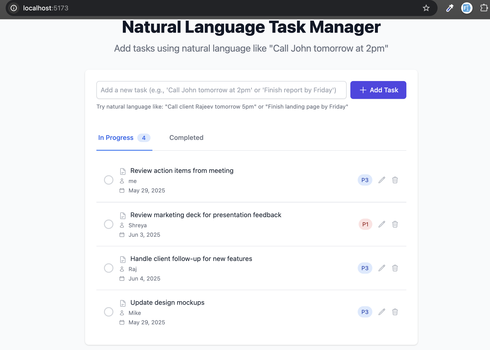
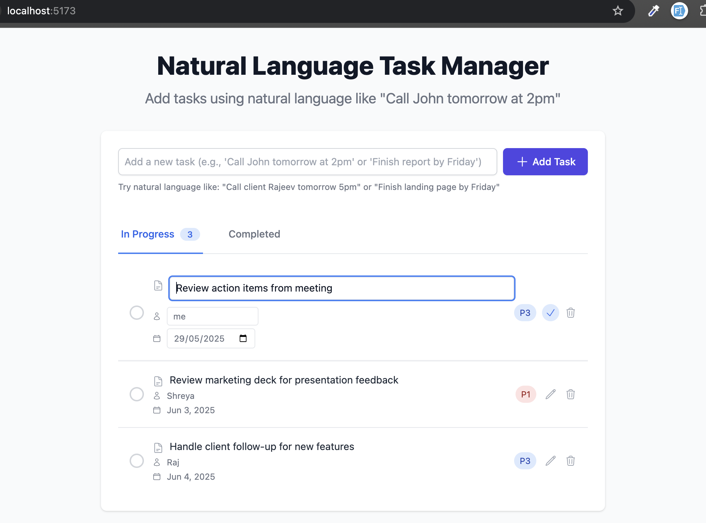

# Enterprise Task Manager

A sophisticated task management application that converts natural language into structured tasks with AI-powered parsing. Built with modern web technologies for optimal performance and user experience.

## ✨ Features

- **Natural Language Processing**: Add tasks using everyday language
- **Smart Task Extraction**: AI automatically identifies:
  - Task description (5-8 word concise format)
  - Assignee (person or team)
  - Due dates and times
  - Priority levels (P1-P4)
- **Intelligent Defaults**: Smart defaults for missing information
- **Responsive Design**: Works on all devices
- **Real-time Updates**: Instant task management
- **Modern UI**: Clean, intuitive interface with Tailwind CSS

## 📋 Example Usage

### Input Text
```
Good morning everyone. Let's review our action items from today's meeting. 

Raj, please handle the client follow-up by Wednesday. The client seemed interested in our new features.

Shreya, could you review the marketing deck tonight? We need your feedback before the presentation.

Sarah, take care of the budget analysis by end of week. Let's make this P2 priority since it's important but not urgent.
```

### Expected Output

Here's how the tasks appear in the application:

```
✅ Review action items from meeting
   Today 5:00 PM • Team • P3

🔄 Develop mobile-responsive landing page
   Tomorrow 10:00 PM • Aman • P3

🔄 Review marketing deck for presentation
   Today 11:59 PM • Shreya • P2

🔄 Complete budget analysis report
   Friday 5:00 PM • Sarah • P2
```




## 📡 API Reference

### Create a New Task

Create a new task using natural language processing.

**Endpoint**
```
POST /api/tasks
```

**Request**
```http
POST http://localhost:5000/api/tasks
Content-Type: application/json

{
  "text": "Mike from the design team, can you update the mockups? I think he's not in our main team but works with us."
}
```

**Response**
```http
HTTP/1.1 201 Created
Content-Type: application/json

{
  "description": "Update design mockups",
  "assignee": "Mike",
  "dueDate": "2025-05-29T11:30:00.000Z",
  "priority": "P3",
  "completed": false,
  "status": "pending",
  "_id": "683834847dfd80c2c20abd93",
  "createdAt": "2025-05-29T10:18:44.145Z",
  "updatedAt": "2025-05-29T10:18:44.145Z",
  "__v": 0
}
```

**Response Fields**
- `description`: Extracted task description
- `assignee`: Person responsible for the task
- `dueDate`: Due date in ISO format
- `priority`: Task priority (P1-P4)
- `completed`: Boolean indicating completion status
- `status`: Current status of the task
- `_id`: Unique identifier for the task
- `createdAt`: Timestamp when the task was created
- `updatedAt`: Timestamp when the task was last updated

## 🛠️ Tech Stack

- **Frontend**:
  - React 18 with TypeScript
  - Vite for fast development
  - Tailwind CSS for styling
  - React Query for data fetching
  - Date-fns for date handling

- **Backend**:
  - Node.js with Express
  - TypeScript for type safety
  - MongoDB with Mongoose
  - OpenAI API for NLP

- **Development Tools**:
  - ESLint & Prettier for code quality
  - Husky for git hooks
  - Jest for testing

## 🚀 Getting Started

### Prerequisites

- Node.js v18 or higher
- npm v9 or higher
- MongoDB (local or Atlas)
- OpenAI API key

### Installation

1. **Clone the repository**
   ```bash
   git clone https://github.com/yourusername/Enterprise-Grade-To-Do-List-Saurabh.git
   cd Enterprise-Grade-To-Do-List-Saurabh
   ```

2. **Set up environment variables**
   - Copy `.env.example` to `.env` in both `client` and `server` directories
   - Update the values in both `.env` files

3. **Install dependencies**
   ```bash
   # Install server dependencies
   cd server
   npm install
   
   # Install client dependencies
   cd ../client
   npm install
   ```

4. **Start the development servers**
   ```bash
   # In server directory
   npm run dev
   
   # In client directory (new terminal)
   npm run dev
   ```

5. **Access the application**
   - Frontend: http://localhost:5173
   - Backend API: http://localhost:5000

## 💡 Usage Examples

### Adding Tasks

Use natural language to add tasks. The AI will automatically extract:

```
"Team meeting tomorrow at 11am about project timeline"
→ Description: "Schedule team meeting for project timeline"
→ Due: Tomorrow at 11:00 AM
→ Assignee: Team
```

```
"Aman, review PR #42 by EOD P1"
→ Description: "Review pull request #42 changes"
→ Assignee: Aman
→ Priority: P1 (Urgent)
→ Due: Today at 5:00 PM
```

### Task Management

- ✅ **Complete**: Click the checkbox
- ✏️ **Edit**: Click the edit icon
- 🗑️ **Delete**: Click the trash icon
- 🔄 **Refresh**: Tasks auto-save and sync


## 🏗 Project Structure

```
├── client/                 # Frontend application
│   ├── public/            # Static assets
│   └── src/
│       ├── api/           # API service layer
│       ├── components/     # Reusable UI components
│       ├── context/        # Global state management
│       ├── hooks/          # Custom React hooks
│       ├── types/          # TypeScript type definitions
│       └── App.tsx         # Root component
│
├── server/                # Backend application
│   ├── src/
│   │   ├── controllers/  # Request handlers
│   │   ├── models/       # Database models
│   │   ├── routes/       # API routes
│   │   ├── utils/        # Helper functions
│   │   └── app.ts        # Express app setup
│   └── test/             # Test files
│
├── .github/              # GitHub workflows
├── .husky/               # Git hooks
└── .vscode/              # VS Code settings


### Backend (server/.env)

- `PORT`: Port number for the backend server (default: 5000)
- `MONGODB_URI`: MongoDB connection string
- `OPENAI_API_KEY`: Your OpenAI API key for natural language processing


